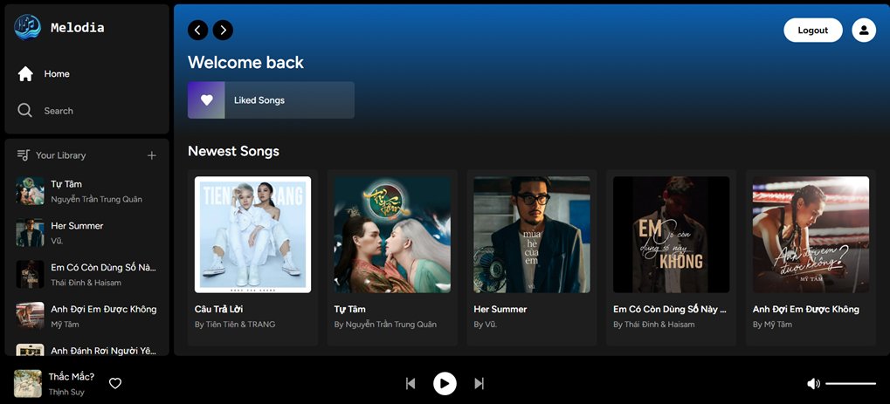
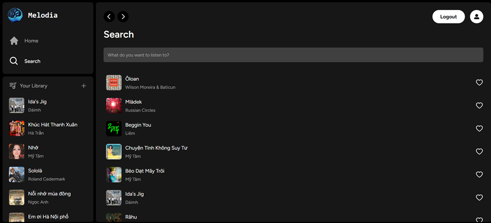
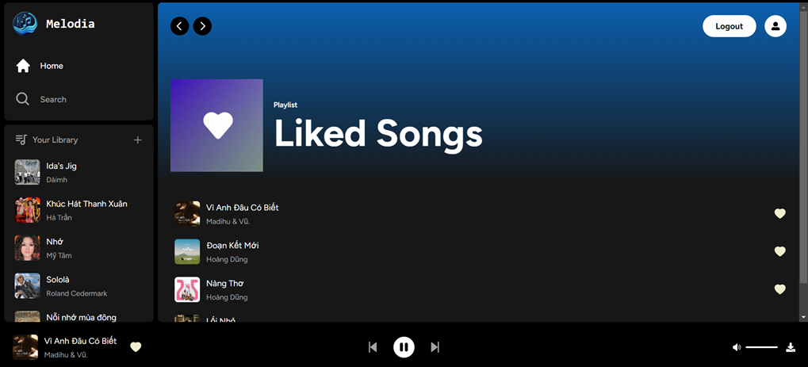

<div align="center">
  
</div>

A user-friendly music streaming platform with recommendation system based on user's listen history.<br> [Link](https://melodia-music-player.vercel.app/)



---

## Tech Stack

<p align="center">
  
  
  
</p>

---

## Features

- Find and listen to songs with user-friendly interfaces.
- Save user's favorite songs.
- Give song recommendations based on user's listen history.

---

## Installation

Clone the frontend branch from Github

```sh
git clone https://github.com/MinhQuan020903/melodia-music-player.git
```

Install packages:

```sh
pnpm install
```

Run the application:

```sh
pnpm run dev
```

---

# Sites

### Home page


### Search page



### Liked songs page



### Search page


---

## Contributors

<table align="center">
  <tr>
  <td align="center">
        <a href="https://github.com/MinhQuan020903">
            
            <br />
            <sub>
                <b>Do Mai Minh Quan</b>
            </sub>
        </a>
        <br />
        </a> 
    </td>
    <td align="center">
        <a href="https://github.com/TinSpaghettiCode">
            
            <br />
            <sub>
                <b>Nguyen Ngoc Tin</b>
            </sub>
        </a>
        <br />
        </a> 
    </td>

  </tr>
</table>
